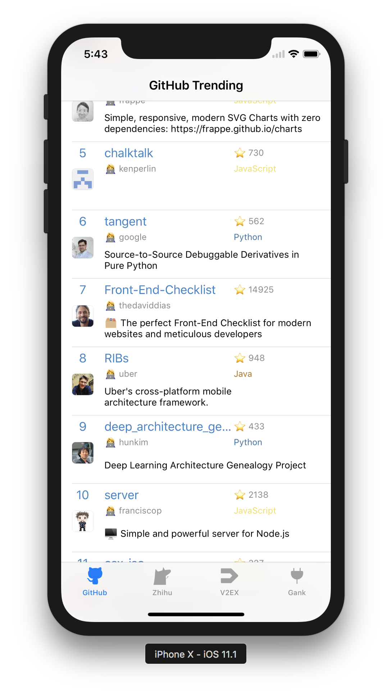
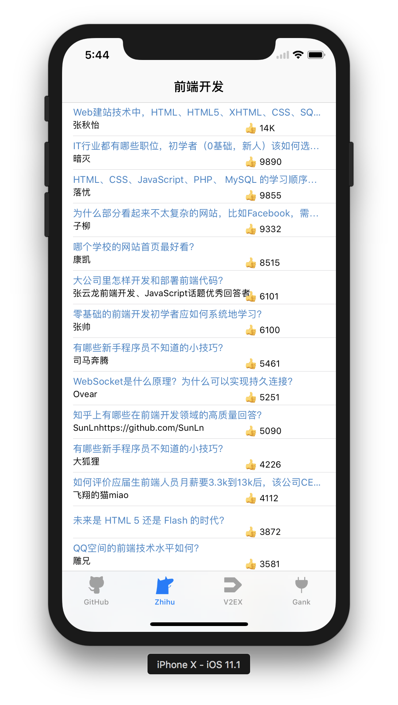
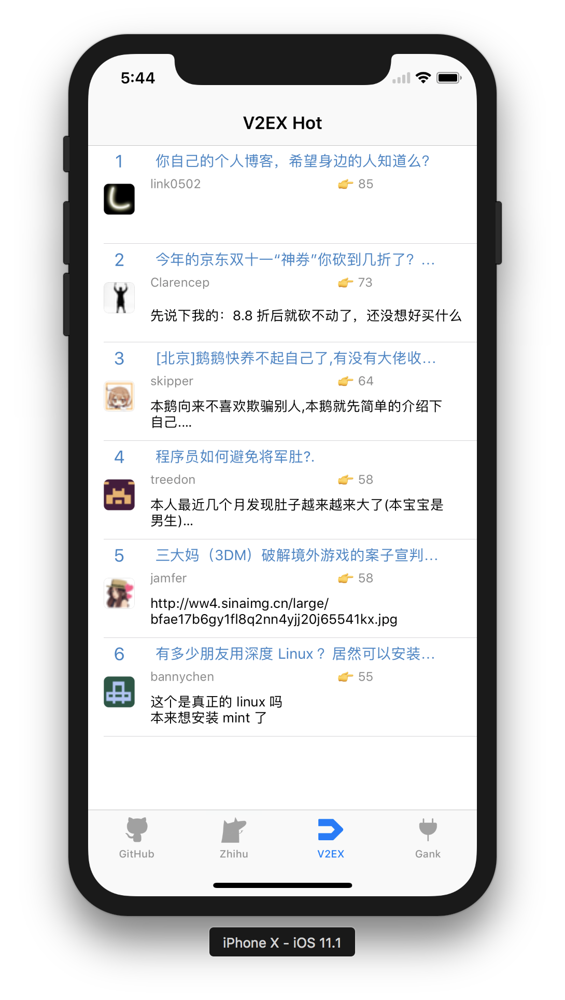
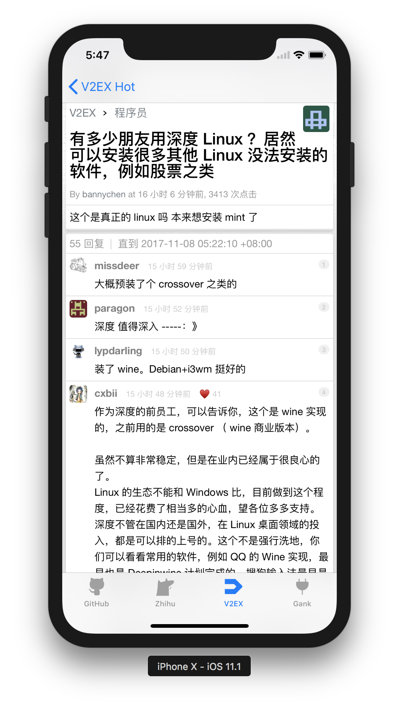

# DeveloperHit

   

After exploring some Web APIs associated with the chosen topic, only a few websites provide friendly APIs, especially when an XML format data response is expected. Therefore we decided to build our own APIs by parsing HTML pages responded from target websites:

- Github

  Github trending exhibits some potential open source projects, however, there are only APIs for specific repository and user. So we will build an unofficial XML-based backend.
- V2EX

  V2EX is a community of technology and design. It provides some APIs for getting latest posts.
- Gank

  Gank.io is a website which provides some interesting frameworks and projects for programmers. Thus, it also pushes some news in software engineering.
- Zhihu

  Zhihu may be the biggest Q&A community in China. We will write a backend with RESTful API, which providing some development-related topic content.

The frontend will integrate lastest and hot information in a list for users. And I plan to implement it on  Web, iOS and Android platform.

## Backend

| Content | URL                                      |
| ------- | ---------------------------------------- |
| GitHub  | http://115.159.1.222:8000/github         |
| Zhihu   | http://115.159.1.222:3001/topic          |
| V2EX    | https://www.v2ex.com/api/topics/hot.json |
| Gank    | http://gank.io/api/day/2015/08/07        |

### GitHub

#### How to Run

```shell
go get github.com/zjzsliyang/go-trending
cd DeveloperHit/Backend
go build
./Backend
# to run in the background
# nohup ./Backend &
```

It will run in the ``8000`` port with the url  ``/github``.

#### Implement

First, to access GitHub data in ``https://github.com/trending``, I reference a web crawler repo and [fork](https://github.com/zjzsliyang/go-trending) it to fix bugs GitHub new trending page via Go. In the backend part, I create a corresponding data structure to store the GitHub data like ``Developer``, ``Project``, ``Projects``. You can find XML Schema in [github.xsd](https://github.com/zjzsliyang/DeveloperHit/blob/master/Backend/github.xsd).

One shortcoming is that after getting the request from frontend to crawler takes too long, and cache in frontend or distributed crawler is in the plan.

To produce the XML format data, I import ``encoding/xml``, which is called as followings:

```go

func Trend(res http.ResponseWriter, req *http.Request) {
	trend := trending.NewTrending()
	xsiUrl := "http://www.w3.org/2001/XMLSchema-instance"
	xmlUrl := "https://github.com/zjzsliyang/DeveloperHit/raw/master/Backend/github.xsd"

	projects, err := trend.GetProjects(trending.TimeToday, "")
	if err != nil {
		log.Fatal(err)
	}
	dataProjects := &Projects{Version: "1", XsiUrl: xsiUrl, XmlUrl: xmlUrl}
	for _, project := range projects {
		dataProject := Project{Name: project.Name, Owner: project.Owner, RepositoryName: project.RepositoryName,
			Description: project.Description, Language: project.Language, Stars: project.Stars}
		if project.URL == nil {
			dataProject.URL = ""
		} else {
			dataProject.URL = project.URL.String()
		}
		if project.ContributorURL == nil {
			dataProject.ContributorURL = ""
		} else {
			dataProject.ContributorURL = project.ContributorURL.String()
		}
		for _, contributor := range project.Contributor {
			dataDeveloper := Developer{ID: contributor.ID, DisplayName: contributor.DisplayName, FullName: contributor.FullName,
				URL: contributor.URL.String(), Avatar: contributor.Avatar.String()}
			dataProject.Contributor = append(dataProject.Contributor, dataDeveloper)
		}
		dataProjects.Project = append(dataProjects.Project, dataProject)
	}
	res.Write([]byte(xml.Header))
	output, err := xml.MarshalIndent(dataProjects, "  ", "    ")
	if err != nil {
		log.Fatal(err)
	}
	res.Write(output)
}
```

### Zhihu

Repo: https://github.com/lisirrx/ZhihuApiBackend

#### How to Run

```shell
npm install
npm start
```

It will run in the ``3001`` port with the url  ``/topic``.

## Frontend

### Web

Repo:  https://github.com/lisirrx/DeveloperHit

### iOS

#### How to Run

[CocoaPods](http://cocoapods.org/) is a dependency manager for Cocoa projects. Run the following command to install the dependency.

```shell
cd DeveloperHit/iOS/DeveloperHit
pod install
```

#### Screenshot

|      |        |
| ------------------------------------- | ------------------------------------- |
|          |          |
|  |  |

#### Implement

iOS part uses MVVM architecture to decouple views and view models. Thus, to satisfy an information aggregation demand, I use table view design widely.

To parse XML data, I call the native ``XMLParser`` function in the ``viewDidLoad`` stage as follows:

```swift
func parser(_ parser: XMLParser, didStartElement elementName: String, namespaceURI: String?, qualifiedName qName: String?, attributes attributeDict: [String : String] = [:]){}
```

```swift
func parser(_ parser: XMLParser, didEndElement elementName: String, namespaceURI: String?, qualifiedName qName: String?) {}
```

```swift
func parser(_ parser: XMLParser, foundCharacters string: String) {}
```

The first function will be called when it starts to parse an XML element, I get the XML element node name and init for the data. In the second function, which will be called after parsing the element, so I assign and store the data. The third function is the parse phase function, to reduce the code amount and a better design, I use KVC(Key-Value Coding) which is a mechanism enabled by the `NSKeyValueCoding` informal protocol that objects adopt to provide indirect access to their properties.  When an object is key-value coding compliant, its properties are addressable via string parameters through a concise, uniform messaging interface. This indirect access mechanism supplements the direct access afforded by instance variables and their associated accessor methods. You can find these code [here](https://github.com/zjzsliyang/DeveloperHit/blob/master/iOS/DeveloperHit/DeveloperHit/GitHubViewController.swift).

To parse JSON data, I use a famous library called [Alamofire](https://github.com/Alamofire/Alamofire). Take ``GankViewController`` for example:

```swift
  func requestGank() {
    Alamofire.request(ServiceBase.GankUrl).response { (response) in
      let json = JSON(data: response.data!)
      for category in self.categorys {
        var tempGank: [Gank] = []
        for (_, subJson): (String, JSON) in json["results"][category] {
          let gank = Gank(id: subJson["_id"].string!, createAt: subJson["createdAt"].string!, desc: subJson["desc"].string!, publishedAt: subJson["publishedAt"].string!, type: subJson["type"].string!, url: subJson["url"].string!, used: subJson["used"].bool!, who: subJson["who"].string!)
          tempGank.append(gank)
        }
        self.ganks.append(tempGank)
      }
      self.initGankTableView()
    }
  }
```

In the request function, it will callback when it gets the response. I index for the key and store the value.

### Android

Repo: https://github.com/tjluozhongjin/DeveloperHit